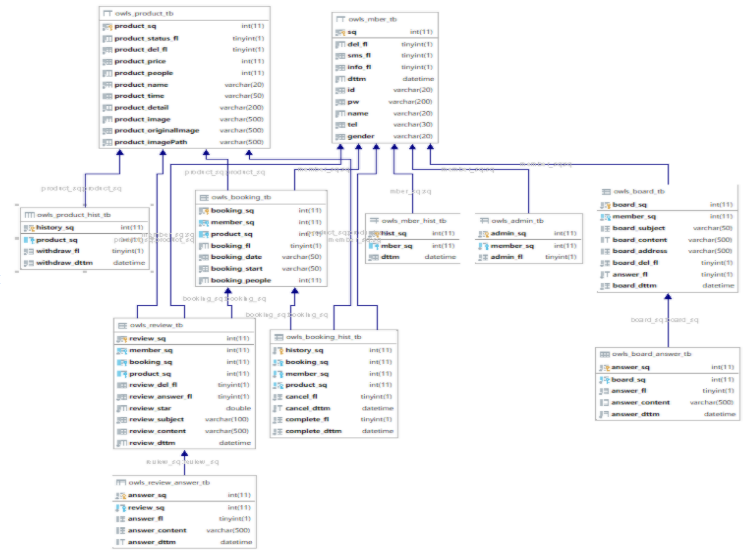

<h1>🦉🦉OWLS PROJECT🦉🦉</h1>

### 1. &nbsp;찜질방 예약 웹사이트

<http://www.steamowls.shop/>

### 2. &nbsp;주요기능

 

**1. 메인메뉴**

 

**2. 예약창**

 

**3. 결제수단 선택**

 

**4. 결제후 마이페이지 이동**

 

**5. 예약내역에서 예약취소**

 

### 3. &nbsp;개발환경

- 기술 &nbsp;스택 
  _ 프로그래밍 &nbsp;언어 &nbsp;: &nbsp;JAVA, &nbsp;JAVASCRIPT 
  _ 데이터베이스 &nbsp;: &nbsp;MariaDB 
- 개발 &nbsp;툴 
  _ IDE &nbsp;: &nbsp;eclipse, &nbsp;VScode 
  _ DB &nbsp;: &nbsp;TOAD  
   

### 4. &nbsp;요구사항

- Member &nbsp;: &nbsp;회원가입/탈퇴, &nbsp;로그인/로그아웃, &nbsp;회원관리(내역, &nbsp;수정)
- Product &nbsp;: &nbsp;상품등록, &nbsp;내역, &nbsp;조회, &nbsp;삭제, &nbsp;판매시작/중지
- Booking &nbsp;: &nbsp;상품예약, &nbsp;내역, &nbsp;정보, &nbsp;결제
- Question &nbsp;: &nbsp;문의작성, &nbsp;내역, &nbsp;수정, &nbsp;삭제,&nbsp; 답변
- Review &nbsp;: &nbsp;리뷰작성, &nbsp;내역, &nbsp;삭제  
   

**4-1. &nbsp;IA 링크** &nbsp;: &nbsp;<https://docs.google.com/spreadsheets/d/1NPMmqGNuMC9KjnsxFDT3IR555BLsJbVrScdaJsYfEQo/edit?usp=sharing>

 
      
**4-2. &nbsp;WIRE &nbsp;FRAME**

- client 
   

- admin 
   
   

**4-3. &nbsp;DB-DIAGRAM**
 
 

 

**4-4. TEST &nbsp;CASE** : <https://docs.google.com/spreadsheets/d/1grv4a0jIDa00YWRaqJUOnDjdUeXvXcbnKTMWdGY8KTo/edit#gid=0>

 

### 역할분담 및 제작기간

  - 이현승 &nbsp;(project-leader)&nbsp;: &nbsp;총괄검토, &nbsp;상품페이지, &nbsp;마이페이지(리뷰)
  - 정현섭 &nbsp;(front-end developer) &nbsp;: &nbsp;JSP, &nbsp;CSS, &nbsp;Javascript
  - 서영준 &nbsp;(back-end developer) &nbsp;: &nbsp;관리자페이지, &nbsp;마이페이지(예약내역), &nbsp;TEST
  - 박소윤 &nbsp;(back-end developer) &nbsp;: &nbsp;회원정보, &nbsp;마이페이지(문의), &nbsp;DB
  - 기간 &nbsp;: 2020.12.03 &nbsp;~ &nbsp;2021.01.24
