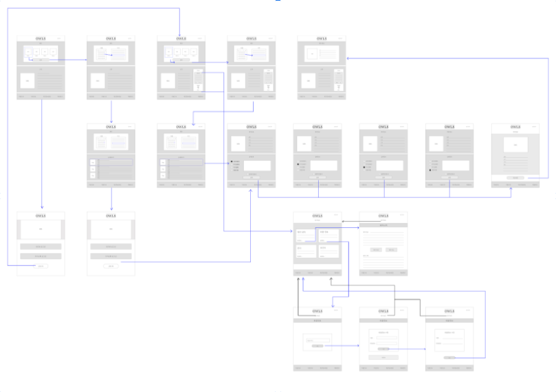
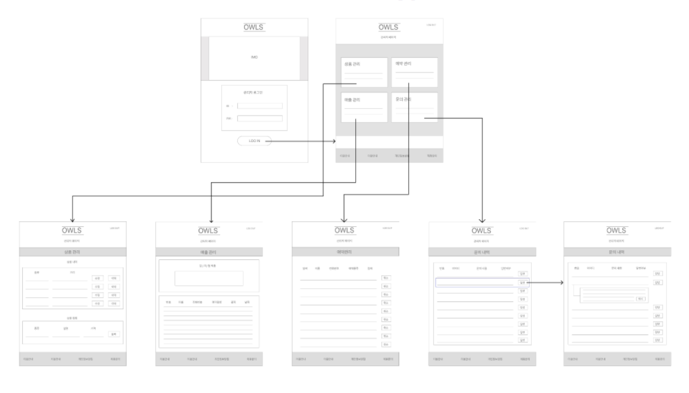

  
<h1>🦉🦉OWLS PROJECT🦉🦉</h1>
 
 

1. 찜질방 예약 웹사이트
  - 이현승 (project-leader) : 총괄검토, 상품페이지, 마이페이지(리뷰)
  - 정현섭 (front-end developer) : JSP, CSS, Javascript
  - 서영준 (back-end developer) : 관리자페이지, 마이페이지(예약내역), TEST
  - 박소윤 (back-end developer) : 회원정보, 마이페이지(문의), DB
  - 기간 : 2020.12.03 ~ 2021.01.24  
   
   
  
2. 요구사항
  - Member : 회원가입/탈퇴, 로그인/로그아웃, 회원관리(내역, 수정)
  - Product : 상품등록, 내역, 조회, 삭제, 판매시작/중지
  - Booking : 상품예약, 내역, 정보, 결제
  - Question : 문의작성, 내역, 수정, 삭제 , 답변
  - Review : 리뷰작성, 내역, 삭제
   
   
  
3. IA 링크 : <https://docs.google.com/spreadsheets/d/1NPMmqGNuMC9KjnsxFDT3IR555BLsJbVrScdaJsYfEQo/edit?usp=sharing>
   
   
  
4. WIRE FRAME
  - client
   
  
  - admin
   
   
   
